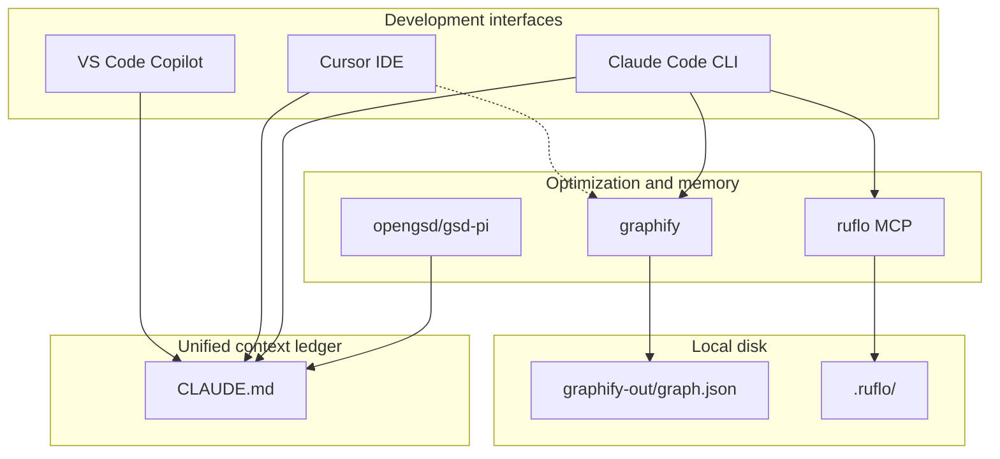

# Unified local-first AI engineering framework

This repository is a **private playbook template** that stitches three dominant interfaces — **VS Code Copilot**, **Cursor**, and **Claude Code CLI** — to three local engines — **@opengsd/gsd-pi**, **graphify**, and **ruflo** — so agents stop re-parsing the whole workspace every session.

## Goals

- **70–95% lower token burn** on structural exploration (graph + ledger vs raw tree walks)
- **Cross-session relevance** via `CLAUDE.md` + `.workflow/` + ruflo HNSW memory
- **Local-first** — graphs and vectors on disk; optional enterprise privacy for cloud tools

## Architecture



## Repository layout

```text
ai-playbook/
  universal/          # Default overlay — any stack
  ios/ android/       # Mobile-native depth
  flutter-*/          # Flutter + state-management variants
  scripts/            # Install overlay into client repos
  config/             # MCP + hook templates
  FRAMEWORK.md        # This document
  EXTENDING.md        # Add new AI tools
```

## Core ledger: `CLAUDE.md`

Every client project gets a root **`CLAUDE.md`** (from `universal/CLAUDE.md`) with four live sections:

1. **Project environment** — stack, build/test commands, enabled engines
2. **Active topography** — graphify hubs (paths into the codebase)
3. **Milestone state** — GSD-Pi / `.gsd/` progress
4. **Cross-session learnings** — durable decisions (ruflo-distilled)

All frontends read this file first. Do not duplicate long architecture prose here — use **`ARCHITECTURE.md`**.

## Day-to-day loop

```text
[1 Session start]  → [2 Milestone check] → [3 Code execution]
        │                                      │
        ▼                                      ▼
 Ingest CLAUDE.md + graphs          GSD review / graph traverse
        │                                      │
        ▼                                      ▼
[4 Session end]  ←  [5 State sync]  ←  ruflo consolidate + graphify refresh
```

| Step | Action |
|------|--------|
| 1 | Open tool; hooks/MCP load local state (no cloud parse yet) |
| 2 | `gsd review` or skim milestone section in `CLAUDE.md` |
| 3 | Edit via graph-targeted reads; run build/test from `AGENTS.md` |
| 4 | Archive `.workflow/`; update `CLAUDE.md` learnings |
| 5 | `npx ruflo@latest memory consolidate --target local`; commit code + ledger |

## Tool setup

### Claude Code (ruflo + graphify hooks)

```bash
npx ruflo@latest init --wizard
claude mcp add ruflo -- npx -y ruflo@latest mcp start

# graphify CLI (pick one)
uv tool install graphifyy          # recommended on macOS/Linux — puts binary in ~/.local/bin
# pip install graphifyy            # alternative if you prefer pip/venv

graphify build                     # requires ~/.local/bin on PATH when using uv tool install
```

Merge `config/claude.settings.local.example.json` into `.claude/settings.local.json` (gitignored). Project `.mcp.json` can include ruflo — see `config/mcp.template.json`.

### Cursor (rules + MCP)

1. Install overlay: `--platform universal`
2. **Settings → MCP**: add graphify server — e.g. `graphify mcp start` if `uv tool install graphifyy` is on your PATH, or `uvx graphifyy mcp start` without a global install
3. Enable **gsd-workflow** MCP for GSD-Pi skills under `.cursor/skills/`
4. Rules in `.cursor/rules/` enforce ledger + token budget

Legacy `.cursorrules` at repo root is optional; prefer `.cursor/rules/`.

### VS Code Copilot (markdown only)

- `.github/copilot-instructions.md` — parsing + ledger rules
- `.github/instructions/*.instructions.md` — thin routing to `ARCHITECTURE.md` / `SESSION_WORKFLOW.md`
- No local MCP — agents use `graphify-out/GRAPH_REPORT.md` as structural ground truth

## Install into a client repo

```bash
bash scripts/install-client-ai-overlay.sh \
  --source-repo ~/private/ai-playbook \
  --client-repo ~/projects/my-api \
  --platform universal \
  --mode symlink
```

Managed paths are excluded from client git via `.git/info/exclude`. See root **`README.md`** for the full path list.

## Choosing a platform overlay

| Project | Platform flag |
|---------|----------------|
| Generic backend/frontend/desktop/infra | `universal` |
| Native iOS | `ios` |
| Native Android | `android` |
| Flutter + Riverpod | `flutter-riverpod` |
| Flutter + Bloc | `flutter-bloc` |

You may start with `universal` and add mobile playbooks later; avoid installing two overlays on the same client without uninstalling first.

## Privacy

- Overlay files stay out of client git history (exclude list).
- Vendors may still process file contents if their product sends workspace context to the cloud — configure enterprise settings separately.

## Further reading

- **`EXTENDING.md`** — register Windsurf, Codex, JetBrains, custom MCP
- **`universal/README.md`** — per-overlay file map
- Mobile-specific: `ios/README.md`, `android/README.md`, etc.
