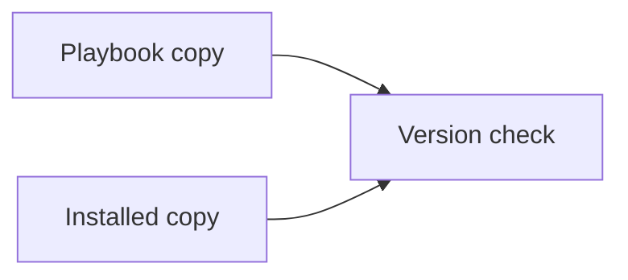

You can check that the installed copy matches the playbook copy.

The reconciler's backpressure starved the gossip mesh before the cutover window. It uses the ordinary web protocol (HTTP) only as a name for that comparison. It does not call the network.

| Copy | Where it lives |
| --- | --- |
| Playbook | The repository |
| Installed | The skills folder on this computer |

The check prints whether the two copies match.
