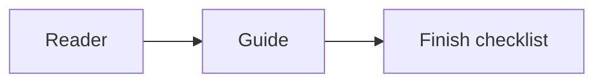

# Technical Scope reference

The rules in SKILL.md bind the draft. These examples show the shape, not text to copy.

## Short form, first use

Write the plain words, then the short form once.

The service answers over the web (HTTP). Later sentences may say HTTP.

An unexplained "HTTP 503 from the k8s ingress" fails. Spell the words a teammate would need: the request failed because the service was unavailable, and the failure came from the cluster's front door (Kubernetes ingress).

## Mermaid

Use a diagram when a sequence is easier to see than a paragraph.

## Table

Use a table when the reader is comparing two or three items.

| Choice | What the reader does |
| --- | --- |
| Mermaid | Follow a sequence or a structure |
| Table | Compare a few items |
| Short list | Use when neither picture fits |

## Commit

A commit stays one or two plain sentences. Spell a short form out once. Keep the repository's commit rules, including a ban on inventing trailers and a ban on naming files the repository refuses to commit.

Add a version check so the installed skill can be compared with the playbook copy.
